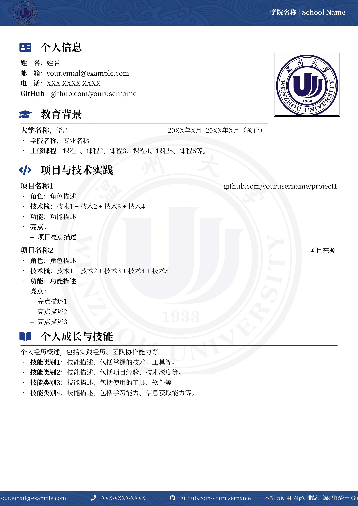

# 温州大学个人简历 LaTeX 模板（本地编译）

一个适配中文的 WZU 风格简历模板，面向 VS Code + LaTeX Workshop 的本地编译环境，使用 XeLaTeX，已配置中文字体与图像素材路径。



---

## 特性

- 中文友好：内置 `Noto Serif SC` 字体，排版规范。
- 本地编译：无需在线编辑器，直接在 VS Code 构建。
- 样式完备：页眉/页脚/背景、配色与图标统一。
- 易改易用：信息分块清晰，按模块替换即可。

## 环境准备

1) 安装 TeX 发行版（推荐 MiKTeX）：https://miktex.org/download

   - 启用自动安装缺失宏包（可选）：

     ```

     initexmf --set-config-value [MPM]AutoInstall=1

     ```
2) Windows 需安装 Strawberry Perl（MiKTeX 工具链依赖）：https://strawberryperl.com/
3) 安装 VS Code 插件：LaTeX Workshop（作者：James Yu）

## VS Code 配置（settings.json）

将以下配置添加到 VS Code 的 `settings.json`：

```json

{

  "latex-workshop.latex.recipe.default": "latexmk (xelatex)",

  "latex-workshop.latex.tools": [

    {

      "name": "xelatexmk",

      "command": "latexmk",

      "args": [

        "-synctex=1",

        "-interaction=nonstopmode",

        "-file-line-error",

        "-xelatex",

        "-outdir=%OUTDIR%",

        "%DOC%"

      ]

    }

  ],

  "latex-workshop.latex.recipes": [

    {

      "name": "latexmk (xelatex)",

      "tools": ["xelatexmk"]

    }

  ]

}

```

## 项目结构

```

d:\work\wzu_resume\

├── main.tex                # 主文档（在此填写内容）

├── fonts\                  # 中文字体（Noto Serif SC）

│   ├── NotoSerifSC.otf

│   └── NotoSerifSC-Bold.otf

├── images\                 # 校徽、页眉页脚、个人照片等

│   ├── wzu_logo.png

│   ├── head_wzu.png

│   ├── foot_wzu.png

│   └── person.png

├── docs\                   # 预览图片

│   └── CV-preview.jpg

└── readme.md

```

## 快速上手

- 打开 `main.tex`，按模块填写：

  - 个人信息（姓名、邮箱、电话、GitHub）
  - 教育背景（学校、专业、时间、课程）
  - 项目与技术实践（项目名/职责/技术栈/亮点）
  - 个人成长与技能（概述与技能分类）
- 替换个人照片：将你的证件照命名为 `images/person.png`。
- 构建：在 VS Code 中按 `Ctrl + Alt + B`，选择 `latexmk (xelatex)` 配方。
- 首次构建若提示安装缺包，允许自动安装即可。

## 命令行构建（可选）

在项目根目录运行：

```

latexmk -synctex=1 -interaction=nonstopmode -file-line-error -xelatex -outdir=. main.tex

```

清理临时文件：

```

latexmk -C

```

## 可定制项

- 颜色：在 `main.tex` 中修改 `primary_color` 与 `secondary_color`（RGB）。
- 字体：如需更换字体，将新字体放入 `fonts/` 并调整 `\setmainfont` 的 `Path` 与文件名。
- 标识素材：按需替换 `images/wzu_logo.png`、`images/head_wzu.png`、`images/foot_wzu.png`。
- 页眉/页脚文案：编辑 `\school` 与 `\contact` 宏即可。

## 常见问题

- Font not found：确认 `fonts/` 目录存在且 `\setmainfont` 的路径与文件名正确。
- 缺少宏包：确保 MiKTeX 自动安装已开启或手动安装提示的宏包。
- 编译卡住/报错：使用 `latexmk -C` 清理后重编；确保图片路径正确。
- 照片尺寸不合适：在 `main.tex` 中调整 `\includegraphics[width=...]` 的宽度。

## 许可证

本模板仅供学习与个人使用，请勿用于商业用途。校徽等素材版权归原单位所有。

Made with ❤️ for WZU students.

WZU A College no one cares you.Everyone thinks about themselves.
